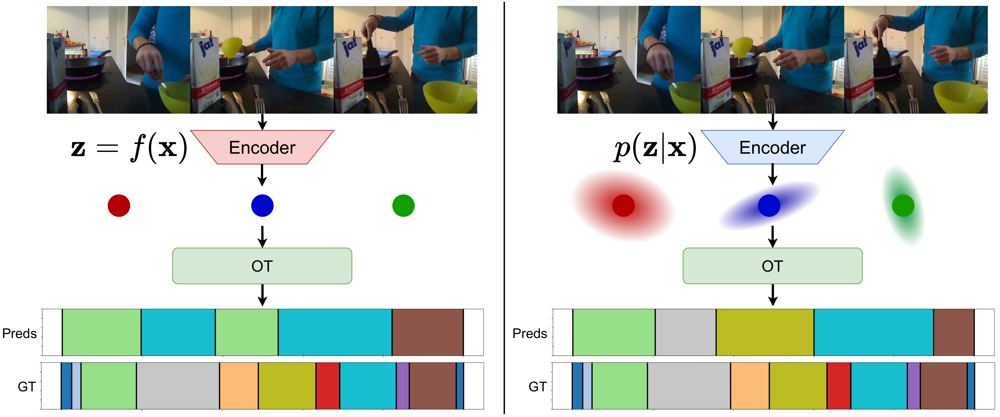

# PEOT



Official implementation of the ECCV2026 paper "Learning Probabilistic Embeddings for Unsupervised Action Segmentation" by Shuai Li, Duc Manh Vu and Juergen Gall.

## Prepare your data
The `data` folder should be aranged in the following way:

```data
data
|--Breakfast
|  `--features
|     `--cereals
|        `--P03_cam01_P03_cereals.txt
|        `...
|     `--coffee
|     `--friedegg
|     `...
|  `--groundTruth
|     `--P03_cam01_P03_cereals
|     `...
|  `--mapping
|     `--mapping.txt
|
|--YTI
|  `...
|
|--FS
|  `...
|--desktop_assembly
|  `...
```

## Training

`python train.py -s --rho 0.2 -r 0.04 -at 0.4 -ae 0.7 -lat 0.1 -ua -lc 1e-4 -d Breakfast` for **deterministic** on BF.

`python train.py -pr -s --rho 0.2 -r 0.04 -at 0.4 -ae 0.7 -lat 0.1 -ua -lc 1e-4 -d Breakfast` for **probabilistic** on BF.

`python train.py -s --rho 0.2 -r 0.02 -lat 0.12 -ua -lc 5e-4 -d YTI` for **deterministic** on YTI.

`python train.py -pr -s --rho 0.2 -r 0.02 -lat 0.12 -ua -lc 5e-4 -d YTI` for **probabilistic** on YTI.

`python train.py -s --rho 0.05 -r 0.02 -lat 0.1 -ua -lc 1e-4 -d FSeval` for **deterministic** on 50Salads (eval split).

`python train.py -pr -s --rho 0.05 -r 0.02 -lat 0.1 -ua -lc 1e-4 -d FSeval` for **probabilistic** on 50Salads (eval split).

`python train.py -s --rho 0.25 -r 0.01 -lat 0.16 -ua -lr 5e-3 -lc 1e-3 -d desktop_assembly` for **deterministic** on DA.

`python train.py -pr -ns 1 -s --rho 0.25 -r 0.01 -lat 0.16 -ua -lr 5e-3 -lc 1e-3 -d desktop_assembly` for **probabilistic** on DA.

## Inference
`python test.py` for standard evaluation across all activities

or `python test.py -v` for standard evaluation, along with generating segmentation visualizations.

If you have any questions using this code, please open an issue. I'll respond ASAP.
